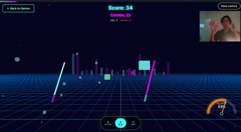
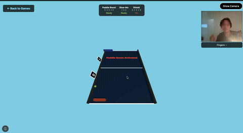
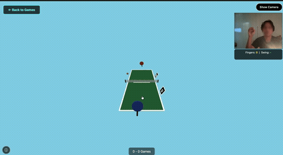

# 🎮 Motion Game Platform

High-performance, modular game platform for hand-tracking powered games using Module Federation.

## 🎥 Demo

<table>
<tr>
<th>Hand Sword</th>
<th>Pong</th>
<th>Tennis</th>
</tr>
<tr>
<td></td>
<td></td>
<td></td>
</tr>
</table>

> 🚧 **Status: actively in development, but playable.** All 3 games are up and running. Multiplayer works but is still rough around the edges (sync/latency issues expected). More games are on the way — expect breaking changes as the platform evolves.

## 🏗️ Architecture

```
motion-platform/
├── host/                    # Platform Host (~50KB gzipped)
│   ├── src/
│   │   ├── core/           # Shared services (singletons)
│   │   │   ├── MediaPipeService.js    # Hand tracking
│   │   │   ├── CameraService.js       # Webcam management
│   │   │   ├── MultiplayerService.js  # WebSocket + WebRTC
│   │   │   └── GameManager.js         # Dynamic game loading
│   │   ├── ui/
│   │   │   └── GameHub.js             # Game launcher UI
│   │   └── main.js
│   ├── index.html
│   ├── vite.config.js
│   └── package.json
│
└── games/
    └── hand-sword/          # Game Module (~200KB gzipped)
        ├── src/
        │   ├── index.js     # Game class (implements standard interface)
        │   ├── audio.js
        │   ├── scene.js
        │   ├── game-logic.js
        │   ├── hand-tracking.js
        │   ├── health-meter.js
        │   ├── background-effects.js
        │   └── ui.js
        ├── manifest.json    # Game metadata
        ├── vite.config.js
        └── package.json
```

## ✨ Features

### Performance Optimized
- **Module Federation**: Dynamic game loading, ~200KB per game
- **Shared Dependencies**: Three.js & Tone.js loaded once (~230KB)
- **Lazy Loading**: Games load on-demand
- **Bundle Splitting**: Optimized chunks per feature
- **Singleton Services**: MediaPipe initialized once, shared across games

### Shared Services
- **MediaPipeService**: Hand tracking with FPS monitoring
- **CameraService**: Single webcam stream for all games
- **MultiplayerService**: WebSocket + WebRTC for P2P gaming
- **GameManager**: Dynamic module loading/unloading

### Multiplayer Ready
- WebSocket signaling server support
- Hand data compression (50ms throttle, 20fps)
- WebRTC P2P for low latency
- Room-based matchmaking

## 🚀 Quick Start

### Development

```bash
# Install dependencies (root workspace)
cd motion-platform
npm install

# Terminal 1 - Start Host Platform (Port 5000)
cd host
npm run dev

# Terminal 2 - Start Game (Port 5001)
cd games/hand-sword
npm run dev

# Or run both in parallel
npm run dev  # From root
```

### Access
- **Platform Hub**: http://localhost:5000
- **Game (standalone)**: http://localhost:5001

## 🎮 Game Interface

Every game must implement this standard interface:

```javascript
export default class MyGame {
  constructor(container, services) {
    // services: { mediaPipe, camera, multiplayer }
  }

  async init() {
    // Initialize game, load assets
  }

  async start() {
    // Start game loop
  }

  pause() {
    // Pause game
  }

  resume() {
    // Resume game
  }

  stop() {
    // Stop game loop
  }

  cleanup() {
    // Dispose resources, unsubscribe
  }
}
```

## 📊 Bundle Sizes

| Component | Size (gzipped) | Notes |
|-----------|----------------|-------|
| Host Platform | ~50KB | Core services only |
| Three.js (shared) | ~150KB | Loaded once, cached |
| Tone.js (shared) | ~80KB | Loaded once, cached |
| MediaPipe (CDN) | ~2MB | Streamed, not bundled |
| Game: hand-sword | ~200KB | Without shared libs |
| **First Load** | **~500KB** | With all shared libs |
| **Game Switch** | **~200KB** | Only new game code |

## 🔧 Adding New Games

1. **Create game folder**
   ```bash
   mkdir -p games/my-game/src
   ```

2. **Create `src/index.js`** with Game class interface

3. **Create `manifest.json`**
   ```json
   {
     "id": "my-game",
     "name": "My Game",
     "remoteEntry": "http://localhost:5002/assets/remoteEntry.js",
     "handTracking": {
       "mode": "dual",
       "maxHands": 2
     }
   }
   ```

4. **Create `vite.config.js`**
   ```javascript
   import { defineConfig } from 'vite';
   import federation from '@originjs/vite-plugin-federation';

   export default defineConfig({
     plugins: [
       federation({
         name: 'myGame',
         filename: 'remoteEntry.js',
         exposes: {
           './Game': './src/index.js'
         },
         shared: {
           'three': { singleton: true },
           'tone': { singleton: true }
         }
       })
     ],
     server: { port: 5002 }
   });
   ```

5. **Register in `host/src/ui/GameHub.js`**
   ```javascript
   const GAMES = [
     // ...existing games
     {
       id: 'my-game',
       name: 'My Game',
       manifestUrl: '/games/my-game/manifest.json',
       // ...
     }
   ];
   ```

## 🎯 Hand Tracking API

```javascript
// Subscribe to hand tracking
this.mediaPipe.subscribe('my-game', (results) => {
  // results.multiHandLandmarks: array of hand landmarks
  // results.multiHandWorldLandmarks: 3D world coordinates
  // results.multiHandedness: left/right classification
});

// Unsubscribe when game ends
this.mediaPipe.unsubscribe('my-game');

// Get FPS
const fps = this.mediaPipe.getFPS();

// Update options
this.mediaPipe.setOptions({
  maxNumHands: 1,
  modelComplexity: 0
});
```

## 🌐 Multiplayer API

```javascript
// Connect to server
await this.multiplayer.connect('ws://localhost:8080');

// Create room
this.multiplayer.createRoom('my-game');

// Join room
this.multiplayer.joinRoom(roomId);

// Broadcast hand data (auto-throttled to 20fps)
this.multiplayer.broadcastHandData(handData);

// Listen for opponent data
this.multiplayer.on('opponentHand', (data) => {
  // Render opponent's hand
});

// Send game state
this.multiplayer.sendGameState({ score, combo });
```

## 📦 Production Build

```bash
# Build all modules
npm run build

# Or individually
cd host && npm run build
cd games/hand-sword && npm run build
```

## 🐛 Debugging

### Dev Mode Features
- FPS monitoring (console every 5s)
- Performance tracking
- Load time metrics
- Hot Module Replacement

### Console Commands
```javascript
// Get current game
gameManager.getCurrentGame()

// Get load time
gameManager.getLoadTime('hand-sword')

// Check MediaPipe FPS
mediaPipeService.getFPS()

// Check multiplayer status
multiplayerService.isConnectedToServer()
```

## 📝 Performance Tips

1. **Preload games**: `gameManager.preloadGame('game-id', manifestUrl)`
2. **Code splitting**: Split large features into separate chunks
3. **Lazy imports**: Use dynamic imports for heavy modules
4. **Dispose properly**: Always call `cleanup()` when unloading
5. **Monitor bundle size**: Keep chunks < 500KB

## 🔒 Security Notes

- **CORS**: Enable CORS for cross-origin game loading
- **CSP**: Configure Content Security Policy for CDN scripts
- **Input validation**: Validate all multiplayer messages
- **Rate limiting**: Throttle multiplayer broadcasts

## 🎨 Current Games

### Hand Sword Rhythm
- **Genre**: Rhythm/Music/Action
- **Players**: 1-2
- **Features**:
  - 4 music themes (Synthwave, Cyberpunk, Chillwave, Drum & Bass)
  - Combo system with background effects
  - Health/accuracy meter
  - 1-hand or 2-hand mode

## 🚧 Roadmap

- [ ] Multiplayer server implementation
- [ ] Game leaderboards
- [ ] Replay system
- [ ] More games!
- [ ] Mobile hand tracking support
- [ ] VR/AR integration

## 📄 License

MIT

---

Built with ❤️ using Vite, Three.js, Tone.js, and MediaPipe
